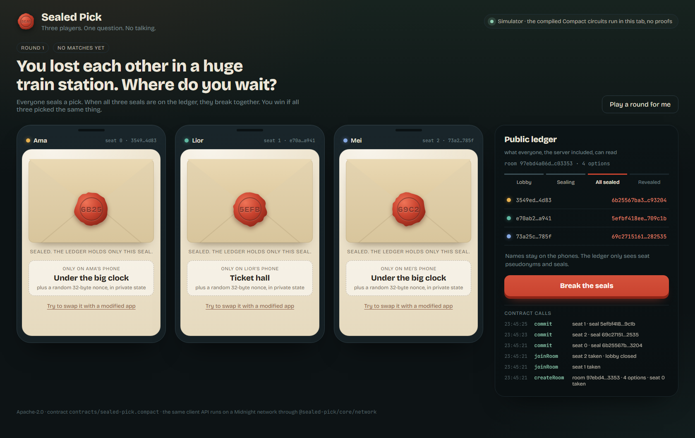
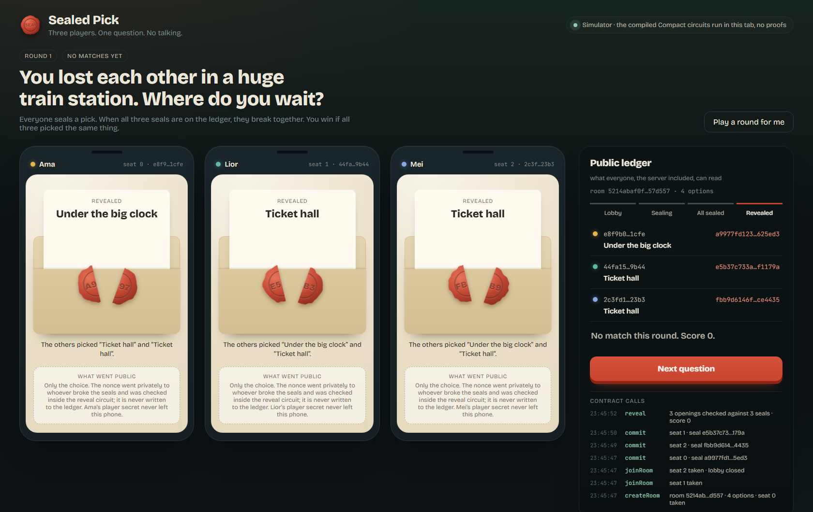

# Sealed Pick

A party game for three people on Midnight. A question comes up, for example "You lost each other in a huge train station. Where do you wait?", and everyone picks an answer without talking. You win the round if all three picked the same thing.

The game only works if nobody can see the other picks early and nobody can change their pick after seeing someone else's. On most platforms that means trusting a server. Here each pick is sealed through a Compact contract: the choice stays in the player's private state, only a commitment goes on the public ledger, and the three seals break together in one transaction.



## How a round works

1. One player opens a room. Two more join, and the third join closes the lobby.
2. Each player picks an answer on their own device and seals it. The `commit` circuit proves that the player owns their seat and that the choice is in range, and discloses only a commitment hash.
3. When all three seals are on the ledger, the players hand their openings to whoever breaks the seals. The `reveal` circuit checks every opening against its seal and publishes the three choices and the score in a single transaction.

Picks cannot leak before the last seal, because the ledger never holds them. A pick cannot be changed after sealing, because the contract refuses a second commitment for the same seat. The browser table lets you try this: "Try to swap it with a modified app" skips the client's own checks and sends a forged opening straight to the circuit, which rejects it.



## What is in this repository

| Path | Contents |
| --- | --- |
| `contracts/sealed-pick.compact` | The contract: rooms, seats, commitments, the atomic reveal and scoring |
| `contracts/managed/sealed-pick/contract` | Generated JavaScript and types, checked in so the simulator runs without the compiler |
| `packages/core` | `SealedPickClient` (one player's private state and the game API), an in-memory `Simulator` that runs the generated circuits, and `MidnightTransport` for a real network |
| `packages/web` | The browser table shown above, built on the simulator |
| `scripts/` | Compiler setup, compilation, the CLI demo and the local devnet run with real proofs |
| `tests/` | 33 tests: contract rules, client behaviour, privacy of the raw ledger, encoding |
| `notes/` | Architecture, API, exact commands, test results and evidence files |

## Run it

You need Node.js 22 or newer. Docker is only needed for compiling the contract and for the local devnet.

Play in the browser (simulator, no wallet or Docker):

```sh
npm ci
npm run build
npm run web:dev
```

Then open http://localhost:5391. "Play a round for me" plays a full round by itself.

Play from the terminal:

```sh
npm run demo
npm run demo -- --mismatch
```

Compile the contract and run the tests:

```sh
npm run setup:compiler
npm run compile
npm test
```

Run a full game on a local Midnight devnet with real zero-knowledge proofs (deploy, create a room, two joins, three commits, one reveal, every transaction finalized):

```sh
npm run devnet:e2e
```

`notes/commands.md` has the details, expected output and troubleshooting.

## What is private and what is public

| Data | Where it lives |
| --- | --- |
| Each player's random 32-byte secret | That player's private state only. It proves seat ownership inside the circuits. |
| A choice and its random nonce before the reveal | The player's private state. Only the commitment is disclosed. |
| Room ID, option count, seat pseudonyms, commitments, counters, phase | Public ledger |
| All three choices and the score after the reveal | Public ledger, written in one transaction |
| Nonces and player secrets after the reveal | Never written to the ledger |

Seat pseudonyms are `persistentHash(domain, roomId, playerSecret)`, so the same player looks unrelated across rooms. Seals are `persistentCommit((domain, roomId, seat, choice), nonce)`. `notes/architecture.md` covers the full boundary, including what the reveal coordinator learns.

## Testing

`npm test` runs 33 tests with Node's built-in runner. They cover duplicate and early actions, seat ownership, changed choices and nonces, swapped openings, room isolation, every commit order, and all 64 answer combinations for four options. One test reads the raw public ledger directly to confirm that no choice appears before the reveal. The local devnet run confirmed eight finalized transactions with real proofs; the public receipts are in `notes/evidence/devnet.json`. Results are listed in `notes/test-results.md`.

## Limits

- The browser table runs on the simulator. It executes the generated circuits but does not create proofs; the devnet run is where proofs are generated and verified.
- Nothing is deployed on a public network yet. Midnight's faucet requires a CAPTCHA, so the end-to-end run uses a local devnet.
- The player who breaks the seals receives the three openings a moment before broadcasting the reveal. This is a cooperative protocol, not threshold encryption.
- Private state is kept in memory, so a player who reloads mid-round cannot rejoin that round.

## License

Apache-2.0. See `LICENSE`. Dependency licenses are listed in `notes/licenses.md`.
